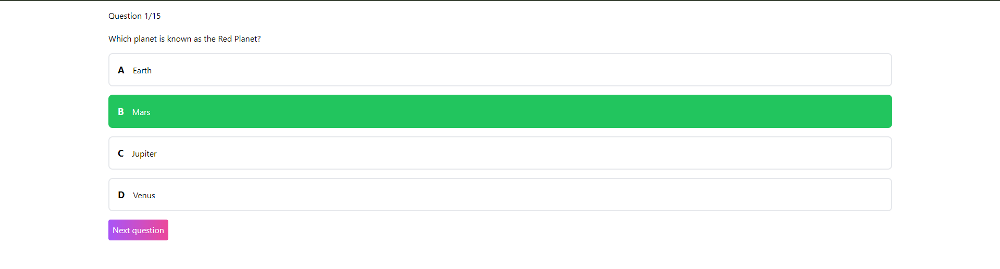

# Quiz Application (Create React App)

The Quiz Application is an interactive web-based quiz platform that allows users to test their knowledge across various subjects, including General Knowledge, React, Node.js, Math, Indian History, and Science and Technology. Users can select a quiz type, answer multiple-choice questions, and receive immediate feedback on their performance. this website is available on : https://quiz-app-mauve-xi.vercel.app/




## Features
- Multiple Quiz Categories: Choose from a variety of topics, including General Knowledge, React, Node.js, Math, Indian History, and Science and Technology.
- Interactive User Interface: A clean and responsive layout for seamless user experience on different devices.
- Instant Feedback: Receive real-time feedback on answers with score updates after each question.
- Score Tracking: View total score at the end of each quiz session.
- Easy Navigation: Intuitive buttons for moving to the next question or finishing the quiz.
- Popup Summary: Display a summary of the user's performance upon quiz completion.

## Installation
#### To run the application locally, follow these steps:

- Clone the repository:
```
git clone https://github.com/yourusername/quiz-application.git
```

- Navigate to the project directory:
```
cd quiz-app
```

- Install dependencies:
```
npm install
```

- Start the application:
```
npm start
```

- The application will run on http://localhost:3000.